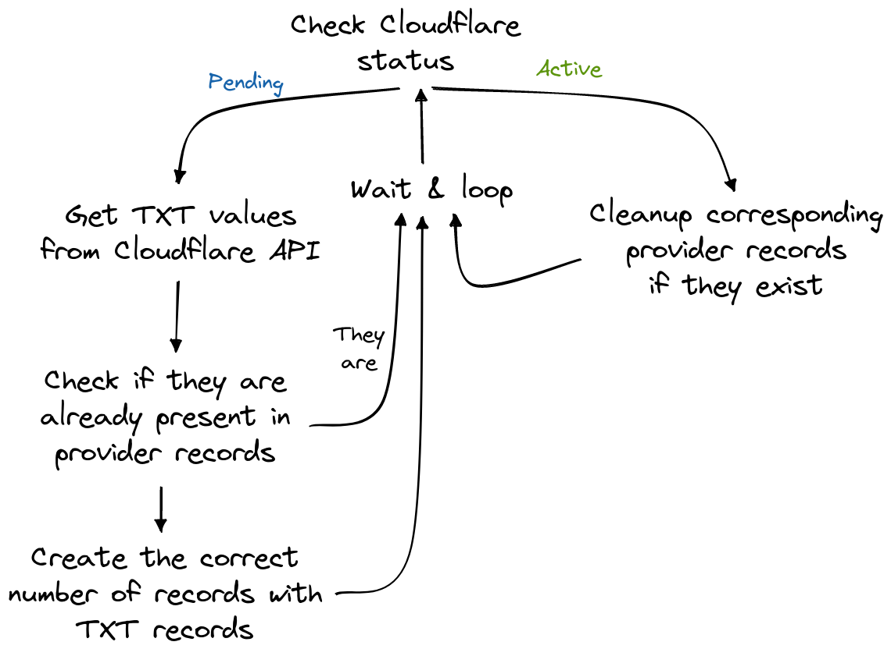

# Cloudflare Certs Renewer


`cfcr` is an utility that updates TXT records when needed in order for Cloudflare Advanced Edge Certificates to be renewed. When using Let's Encrypt provider, this operation must be done manually every 3 months, which end up being time-consuming.


## Warning: Project Archived

**Note:** This project is no longer actively maintained.

This project has been archived and is no longer actively maintained due to Cloudflare's DCV (Domain Control Validation) mechanism release for DNS-01 challenged certificates.

References:
* https://blog.cloudflare.com/introducing-dcv-delegation/
* https://developers.cloudflare.com/ssl/edge-certificates/changing-dcv-method/methods/delegated-dcv/

We encourage you to use this Cloudflare-managed system instead.


## Usage

The CLI usage of `cfcr` is really simple, as everything is configured using a YAML file ([see](#config)):

```
Usage of cfcr:
  -config-dir string
        configuration directory (default "conf.d")
  -dry-run
        run in dry mode: no writing action will be performed, only reading
  -run-once bool
        run the program once and do not loop forever
```
## Config

By default, `cfcr` merges all the YAML files located in `./conf.d/`. The directory path can be updated using the flag `--config-dir`. As demonstrated in this repo, we recommend you to split the configuration and the secrets into two separate configuration files.

### Authenticate to Cloudflare


`cfcr` uses the [authorization request header field](https://www.rfc-editor.org/rfc/rfc6750#section-2.1). In order for the program to run authenticated requests to Cloudflare's API, it needs an API token with the following permissions:

*  `Zone:Read`
*  `Zone Settings:Read`
*  `SSL and Certificates:Read`


This token should be written in the `.auth.cloudflare.token` field in one of the YAML configuration file.

## Providers

For now, only one DNS provider is supported: OVH. If you need another one, feel free to contribute! The integration if new providers should be easy thanks to the `Providers` interface.

### OVH

To generate OVH API keys needed in your configuration, you have to:

* navigate to [the Create API Keys page](https://www.ovh.com/auth/api/createToken);
* choose an application name and descriptionn as well as a validity duration;
* finally, select the correct permissions:
  * `GET` `/domain/zone/*`
  * `POST` `/domain/zone/*`
  * `DELETE` `/domain/zone/*`


## Metrics

`cfcr` is shipped with an embedded Prometheus exporter that exposes basic metrics about the program behavior (stack/heap allocations...) and some others about certs renewal, especially:

* `cfcr_domains_watched_total`: the number of domains `cfcr` is watching;
* `cfcr_last_updated_timestamp`: when was a given domain last updated by `cfcr`. There is one version of this metric for each watched domain.

## Internals



## License

[MIT](https://choosealicense.com/licenses/mit/)